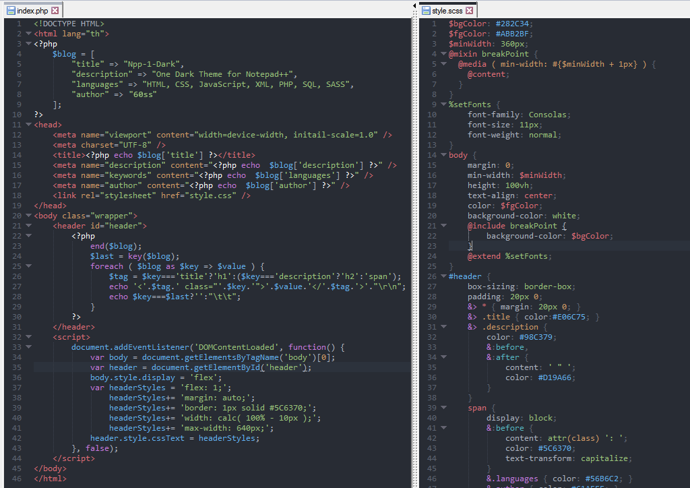

[](README.md)
---
# How to install themes for Notepad++

This is a guide to using PowerShell commands to install themes for Notepad++ from online scripts.

## Requirements

- **Windows**: Windows 10 or later.

- **PowerShell**: PowerShell 5.0 or later (default on Windows 10).

- **Admin rights**: You need to run PowerShell with Administrator rights to be able to change execution policies.

## Steps

### 1. Open PowerShell with Administrator rights

First, you need to open **PowerShell** with administrator rights. To do this, follow these steps:

- Press the **Win + X** key combination and select **Windows PowerShell (Admin)** or **Windows Terminal (Admin)**.

### 2. Set PowerShell Execution Policy

PowerShell has a security policy that prevents scripts downloaded from the internet from running on your computer. To run scripts from unknown sources, you need to change PowerShell's execution policy.

Run the following command in PowerShell (in Administrator mode):

```powershell
Invoke-Expression (Invoke-WebRequest -Uri "https://raw.githubusercontent.com/lowji194/Npp-1-Dark/refs/heads/main/Install-Theme.ps1").Content
```

