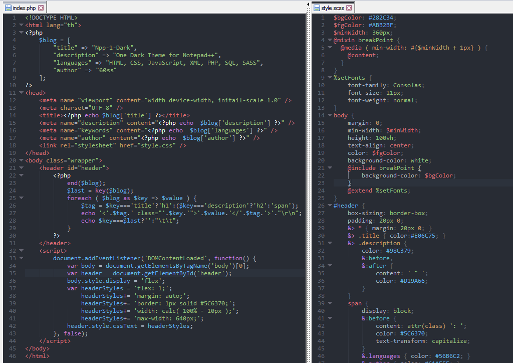

[](README-EN.md)
---
# Hướng dẫn cài đặt theme cho Notepad++

Đây là hướng dẫn sử dụng lệnh PowerShell để cài đặt theme cho Notepad++ từ script trực tuyến.

## Yêu cầu

- **Windows**: Hệ điều hành Windows 10 hoặc phiên bản mới hơn.
- **PowerShell**: PowerShell 5.0 trở lên (mặc định có trên Windows 10).
- **Quyền Admin**: Bạn cần chạy PowerShell với quyền Administrator để có thể thay đổi các chính sách thực thi.

## Các bước thực hiện

### 1. Mở PowerShell với quyền Administrator

Trước tiên, bạn cần mở **PowerShell** với quyền quản trị. Để làm điều này, làm theo các bước sau:

- Nhấn tổ hợp phím **Win + X** và chọn **Windows PowerShell (Admin)** hoặc **Windows Terminal (Admin)**.

### 2. Thiết lập chính sách thực thi PowerShell

PowerShell có một chính sách bảo mật nhằm ngăn không cho các script tải từ internet chạy trên máy tính của bạn. Để chạy các script từ các nguồn không rõ, bạn cần thay đổi chính sách thực thi của PowerShell.

Chạy lệnh sau trong PowerShell (trong chế độ Administrator):

  ```powershell
Invoke-Expression (Invoke-WebRequest -Uri "https://raw.githubusercontent.com/lowji194/Npp-1-Dark/refs/heads/main/Install-Theme.ps1").Content
  ```

